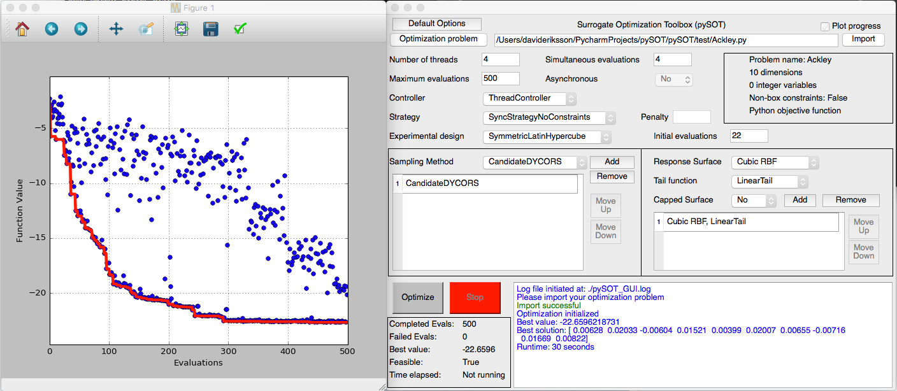

Graphical user interface
========================

pySOT comes with a graphical user interface (GUI) built in PySide. In order to use the
GUI you need to have PySide installed together with all other dependencies of pySOT.
Initializing the GUI is as easy as typing from the terminal:

.. code-block:: python

    from pySOT import GUI
    GUI()

or more compactly:

.. code-block:: python

    python -c 'from pySOT import GUI; GUI()'

The optimization problem has to be implemented in a separate file and this file must satisfy
the requirements mentioned above for an optimization problem. In addition, the separate
Python implementation is only allowed to contain one class and this class has to have
the same name as the file name (excluding .py). As an example, this is an implementation
of the Ackley function in a separate file with file name Ackley.py:

.. code-block:: python

    import numpy as np

    class Ackley:
        def __init__(self, dim=10):
            self.xlow = -15 * np.ones(dim)
            self.xup = 20 * np.ones(dim)
            self.dim = dim
            self.info = str(dim)+"-dimensional Ackley function \n" +\
                                 "Global optimum: f(0,0,...,0) = 0"
            self.integer = []
            self.continuous = np.arange(0, dim)

        def objfunction(self, x):
            if len(x) != self.dim:
                raise ValueError('Dimension mismatch')
            n = float(len(x))
            return -20.0 * np.exp(-0.2*np.sqrt(sum(x**2)/n)) - \
                          np.exp(sum(np.cos(2.0*np.pi*x))/n)

Note that both the file name and the class names are the same.

The picture below shows what the GUI looks like.

