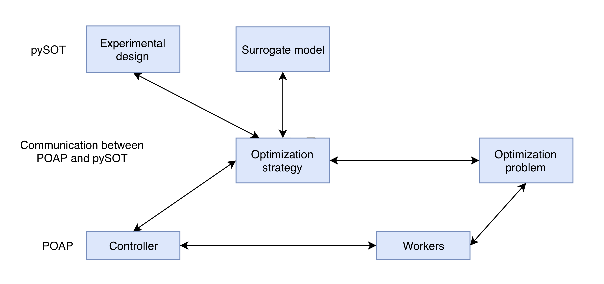

POAP
====

pySOT uses POAP, which an event-driven framework for building and combining
asynchronous optimization strategies. There are two main components in POAP,
namely controllers and strategies. The controller is  capable of asking workers to
run function evaluations and the strategy decides where to evaluate next. POAP
works with external black-box objective functions and handles potential crashes
in the objective function evaluation. There is also a logfile from which all function
evaluations can be accessed after the run finished. In its simplest form, an
optimization code with POAP that evaluates a function predetermined set of
points using NUM_WORKERS threads may look the following way:

.. code-block:: python

   from poap.strategy import FixedSampleStrategy
   from poap.strategy import CheckWorkStrategy
   from poap.controller import ThreadController
   from poap.controller import BasicWorkerThread

   # samples = list of sample points ...

   controller = ThreadController()
   sampler = FixedSampleStrategy(samples)
   controller.strategy = CheckWorkerStrategy(controller, sampler)

   for i in range(NUM_WORKERS):
      t = BasicWorkerThread(controller, objective)
      controller.launch_worker(t)

   result = controller.run()
   print 'Best result: {0} at {1}'.format(result.value, result.params)

Controller
----------

The controller is responsible for accepting or rejecting proposals by the strategy object,
controlling and monitoring the workers, and informing the strategy object of relevant events.
Examples of relevant events are the processing of a proposal, or status updates on a function
evaluation. Interactions between controller and the strategies are organized around proposals
and evaluation records. At the beginning of the optimization and on any later change to the
system state, the controller requests a proposal from the strategy. The proposal consists of an
action (evaluate a function, kill a function, or terminate the optimization), a list of parameters,
and a list of callback functions to be executed once the proposal is processed. The controller
then either accepts the proposal (and sends a command to the worker), or rejects the proposal.

When the controller accepts a proposal to start a function evaluation, it creates an evaluation
record to share information about the status of the evaluation with the strategy. The evaluation
record includes the evaluation point, the status of the evaluation, the value (if completed),
and a list of callback functions to be executed on any update. Once a proposal has been accepted
or rejected, the controller processes any pending system events (e.g. completed or canceled
function evaluations), notifies the strategy about updates, and requests the next proposed action.

POAP comes with a serial controller which is the controller of choice when objective function
evaluations are carried out in serial. There is also a threaded controller that dispatches work
to a queue of workers where each worker is able to handle evaluation and kill requests. The
requests are asynchronous in the sense that the workers are not required to complete the
evaluation or termination requests. The worker is forced to respond to evaluation requests, but
may ignore kill requests. When receiving an evaluation request, the worker should either attempt
the evaluation or mark the record as killed. The worker sends status updates back to the controller
by updating the relevant record. There is also a third controller that uses simulated time, which
is very useful for testing asynchronous optimization strategies.

Strategy
--------

The strategy is the heart of the optimization algorithm, since it is responsible for choosing
new evaluations, killing evaluations, and terminating the optimization run when a stopping
criteria is reached. POAP provides some basic default strategies based on non-adaptive sampling
and serial optimization routines and also some strategies that adapt or combine other strategies.

Different strategies can be composed by combining their control actions, which can be used to
let a strategy cycle through a list of optimization strategies and select the most promising
of their proposals. Strategies can also subscribe to be informed of all new function evaluations
so they incorporate any new function information, even though the evaluation was proposed by another
strategy. This makes it possible to start several independent strategies while still allowing each
strategy to look at the function information that comes from function evaluations proposed by other
strategies. As an example we can have a local optimizer strategy running a gradient based method
where the starting point can be selected based on the best point found by any other strategy. The
flexibility of the POAP framework makes combined strategies like these very straightforward.

Workers
-------

The multi-threaded controller employs a set of workers that are capable of managing concurrent
function evaluations. Each worker does not provide parallelism on its own, but the worker itself
is allowed to exploit parallelism by separate external processes.

There are workers that are capable of calling Python objective function when asked to do an
evaluation, which only results in parallelism if the objective function implementation itself
allows parallelism. There are workers that use subprocesses in order to carry out external
objective function evaluations that are not necessarily in Python. The user is responsible
for specifying how to evaluate the objective function and how to parse partial information
if available.

POAP is also capable of having workers connect to a specified TCP/IP port in order to communicate
with the controller. This functionality is useful in a cluster setting, for example, where the workers
should run on compute nodes distinct from the node where the controller is running. It is also very
useful in a setting where the workers run on a supercomputer that has a restriction on the number
of hours per job submission. Having the controller run on a separate machine will allow the
controller to keep running and the workers to reconnect and continue carrying out evaluations.

Communication between POAP and pySOT
------------------------------------

