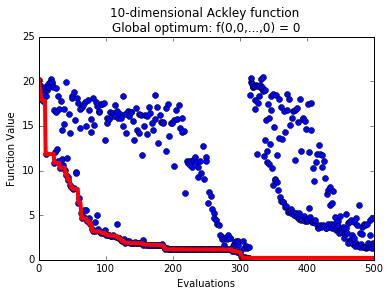
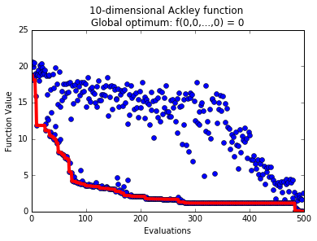

First example to show how to use pySOT in serial and synchronous
parallel for bound constrained optimization problems

**Step 1:** Import modules and create pySOT objects (1)-(4)

.. code-block:: python

    # Import the necessary modules
    from pySOT import *
    from poap.controller import SerialController, ThreadController, BasicWorkerThread
    import numpy as np

    # Decide how many evaluations we are allowed to use
    maxeval = 500

    # (1) Optimization problem
    # Use the 10-dimensional Ackley function
    data = Ackley(dim=10)
    print(data.info)

    # (2) Experimental design
    # Use a symmetric Latin hypercube with 2d + 1 samples
    exp_des = SymmetricLatinHypercube(dim=data.dim, npts=2*data.dim+1)

    # (3) Surrogate model
    # Use a cubic RBF interpolant with a linear tail
    surrogate = RBFInterpolant(kernel=CubicKernel, tail=LinearTail, maxp=maxeval)

    # (4) Adaptive sampling
    # Use DYCORS with 100d candidate points
    adapt_samp = CandidateDYCORS(data=data, numcand=100*data.dim)

**Step 2:** Launch a serial controller and use standard Surrogate Optimization strategy

.. code-block:: python

    # Use the serial controller (uses only one thread)
    controller = SerialController(data.objfunction)

    # (5) Use the sychronous strategy without non-bound constraints
    strategy = SyncStrategyNoConstraints(
            worker_id=0, data=data, maxeval=maxeval, nsamples=1,
            exp_design=exp_des, response_surface=surrogate,
            sampling_method=adapt_samp)
    controller.strategy = strategy

    # Run the optimization strategy
    result = controller.run()

    # Print the final result
    print('Best value found: {0}'.format(result.value))
    print('Best solution found: {0}'.format(
        np.array_str(result.params[0], max_line_width=np.inf,
                    precision=5, suppress_small=True)))

Possible output:

.. code-block:: python

    Best value found: 0.211036185111
    Best solution found: [ 0.02193  0.00486  0.03323  0.03656 -0.00228 -0.00414  0.05239 -0.08511 -0.0002   0.00104]

**Step 3:** Make a progress plot

.. code-block:: python

    import matplotlib.pyplot as plt

    # Extract function values from the controller
    fvals = np.array([o.value for o in controller.fevals])

    f, ax = plt.subplots()
    ax.plot(np.arange(0,maxeval), fvals, 'bo')  # Points
    ax.plot(np.arange(0,maxeval), np.minimum.accumulate(fvals), 'r-', linewidth=4.0)  # Best value found
    plt.xlabel('Evaluations')
    plt.ylabel('Function Value')
    plt.title(data.info)
    plt.show()

Possible output:

**Step 4:** Launch a threaded controller with 4 workers and use standard Surrogate Optimization strategy
allowing to do 4 simultaneous in parallel. Notice how similar the code in Step 3 is to the code in Step 2.

.. code-block:: python

    # Use the threaded controller
    controller = ThreadController()

    # (5) Use the sychronous strategy without non-bound constraints
    # Use 4 threads and allow for 4 simultaneous evaluations
    nthreads = 4
    strategy = SyncStrategyNoConstraints(
            worker_id=0, data=data, maxeval=maxeval, nsamples=nthreads,
            exp_design=exp_des, response_surface=surrogate,
            sampling_method=adapt_samp)
    controller.strategy = strategy

    # Launch the threads and give them access to the objective function
    for _ in range(nthreads):
        worker = BasicWorkerThread(controller, data.objfunction)
        controller.launch_worker(worker)

    # Run the optimization strategy
    result = controller.run()

    # Print the final result
    print('Best value found: {0}'.format(result.value))
    print('Best solution found: {0}'.format(
        np.array_str(result.params[0], max_line_width=np.inf,
                    precision=5, suppress_small=True)))

Possible output:

.. code-block:: python

    Best value found: 0.0143986694788
    Best solution found: [-0.00869 -0.00018 -0.00311 -0.00211  0.00098  0.00161  0.00219 -0.00241  0.00285  0.00255]

**Step 5** Make a progress plot

.. code-block:: python

    import matplotlib.pyplot as plt

    # Extract function values from the controller
    fvals = np.array([o.value for o in controller.fevals])

    f, ax = plt.subplots()
    ax.plot(np.arange(0,maxeval), fvals, 'bo')  # Points
    ax.plot(np.arange(0,maxeval), np.minimum.accumulate(fvals), 'r-', linewidth=4.0)  # Best value found
    plt.xlabel('Evaluations')
    plt.ylabel('Function Value')
    plt.title(data.info)
    plt.show()

Possible output:

