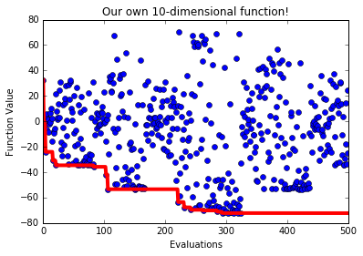

This example shows how to define our own optimization problem in pySOT

**Step 1:** Define our own optimization problem

.. code-block:: python

    class SomeFun:
        def __init__(self, dim=10):
            self.xlow = -10 * np.ones(dim) # lower bounds
            self.xup = 10 * np.ones(dim) # upper bounds
            self.dim = dim # dimensionality
            self.info = "Our own " + str(dim)+"-dimensional function" # info
            self.integer = np.array([0]) # integer variables
            self.continuous = np.arange(1, dim) # continuous variables

        def objfunction(self, x):
            return np.sum(x) * np.cos(np.sum(x))

**Step 2:** Let's make sure that our optimization problem follows the pySOT standard

.. code-block:: python

    import numpy as np
    from pySOT import check_opt_prob
    data = SomeFun(dim=10)
    check_opt_prob(data)

Everything is fine as long as pySOT doesn't complain!

**Step 3:** Import modules and create pySOT objects (1)-(4)

.. code-block:: python

    # Import the necessary modules
    from pySOT import *
    from poap.controller import SerialController, BasicWorkerThread

    # Decide how many evaluations we are allowed to use
    maxeval = 500

    # (1) Optimization problem
    # Use our 10-dimensional function
    print(data.info)

    # (2) Experimental design
    # Use a symmetric Latin hypercube with 2d + 1 samples
    exp_des = SymmetricLatinHypercube(dim=data.dim, npts=2*data.dim+1)

    # (3) Surrogate model
    # Use a cubic RBF interpolant with a linear tail
    surrogate = RBFInterpolant(kernel=CubicKernel, tail=LinearTail, maxp=maxeval)

    # (4) Adaptive sampling
    # Use DYCORS with 100d candidate points
    adapt_samp = CandidateDYCORS(data=data, numcand=100*data.dim)

Output:

.. code-block:: python

    Our own 10-dimensional function

**Step 4:** Run the optimization in serial

.. code-block:: python

    # Use the serial controller (uses only one thread)
    controller = SerialController(data.objfunction)

    # (5) Use the sychronous strategy without non-bound constraints
    strategy = SyncStrategyNoConstraints(
            worker_id=0, data=data, maxeval=maxeval, nsamples=1,
            exp_design=exp_des, response_surface=surrogate,
            sampling_method=adapt_samp)
    controller.strategy = strategy

    # Run the optimization strategy
    result = controller.run()

    # Print the final result
    print('Best value found: {0}'.format(result.value))
    print('Best solution found: {0}'.format(
        np.array_str(result.params[0], max_line_width=np.inf,
                    precision=5, suppress_small=True)))

Possible output:

.. code-block:: python

    Best value found: -72.2440613978
    Best solution found: [ 9.       5.58049  9.34501  5.35848  9.26448  9.05695  5.45796  1.80559  8.16331  9.21498]

**Step 5:** Plot the progress:

.. code-block:: python

    import matplotlib.pyplot as plt

    # Extract function values from the controller
    fvals = np.array([o.value for o in controller.fevals])

    f, ax = plt.subplots()
    ax.plot(np.arange(0,maxeval), fvals, 'bo')  # Points
    ax.plot(np.arange(0,maxeval), np.minimum.accumulate(fvals), 'r-', linewidth=4.0)  # Best value found
    plt.xlabel('Evaluations')
    plt.ylabel('Function Value')
    plt.title(data.info)
    plt.show()

Possible output:

