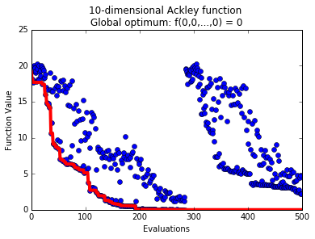

This example shows how to use pySOT with an objective function that is written in MATLAB.
You need the matlab_wrapper module or the MATLAB engine which is available for MATLAB
R2014b or later. This example uses the matlab_wrapper module to work for older versions
of MATLAB as well.

**Step 1:** The following shows an implementation of the Ackley function in a MATLAB
script matlab_ackley.m that takes a variable x from the workspace and saves the value
of the objective function as val:

.. code-block:: matlab

    dim = length(x);
    val = -20*exp(-0.2*sqrt(sum(x.^2,2)/dim)) - ...
      exp(sum(cos(2*pi*x),2)/dim) + 20 + exp(1);

**Step 2:** This will create a MATLAB session. You may need to specify the root
folder of your MATLAB installation. Type matlabroot in a MATLAB session to see
what the root folder is.

.. code-block:: python

    import matlab_wrapper
    matlab = matlab_wrapper.MatlabSession(matlab_root='/Applications/MATLAB_R2014a.app', options='-nojvm')

**Step 3:** Define Python optimization problem that uses our MATLAB objective function
to do function evaluations:

.. code-block:: python

    # This is the path to the external MATLAB function, assuming it is in your current path
    import os
    mfile_location = os.getcwd()
    matlab.workspace.addpath(mfile_location)

    class AckleyExt:
        def __init__(self, dim=10):
            self.xlow = -15 * np.ones(dim)
            self.xup = 20 * np.ones(dim)
            self.dim = dim
            self.info = str(dim) + "-dimensional Ackley function \n" + \
                "Global optimum: f(0,0,...,0) = 0"
            self.min = 0
            self.integer = []
            self.continuous = np.arange(0, dim)

        def objfunction(self, x):
            matlab.put('x', x)
            matlab.eval('matlab_ackley')
            val = matlab.get('val')
            return val

** Step 4:** Optimize over our optimization problem

.. code-block:: python

    from pySOT import *
    from poap.controller import SerialController, BasicWorkerThread
    import numpy as np

    maxeval = 500

    data = AckleyExt(dim=10)
    print(data.info)

    # Use the serial controller for simplicity
    # In order to run in parallel we need to maintain an array of MATLAB session
    controller = SerialController(data.objfunction)
    controller.strategy = \
        SyncStrategyNoConstraints(
            worker_id=0, data=data,
            maxeval=maxeval, nsamples=1,
            exp_design=LatinHypercube(dim=data.dim, npts=2*(data.dim+1)),
            response_surface=RBFInterpolant(kernel=CubicKernel, tail=LinearTail, maxp=maxeval),
            sampling_method=CandidateDYCORS(data=data, numcand=100*data.dim))

    # Run the optimization strategy
    result = controller.run()

    # Print the final result
    print('Best value found: {0}'.format(result.value))
    print('Best solution found: {0}'.format(
        np.array_str(result.params[0], max_line_width=np.inf,
                     precision=5, suppress_small=True)))

Possible output:

.. code-block:: python

    10-dimensional Ackley function
    Global optimum: f(0,0,...,0) = 0
    Best value found: 0.00665167450159
    Best solution found: [-0.00164  0.00162 -0.00122  0.0019  -0.00109  0.00197 -0.00102 -0.00124 -0.00194  0.00216]

**Step 5:** Plot the progress:

.. code-block:: python

    import matplotlib.pyplot as plt

    # Extract function values from the controller
    fvals = np.array([o.value for o in controller.fevals])

    f, ax = plt.subplots()
    ax.plot(np.arange(0,maxeval), fvals, 'bo')  # Points
    ax.plot(np.arange(0,maxeval), np.minimum.accumulate(fvals), 'r-', linewidth=4.0)  # Best value found
    plt.xlabel('Evaluations')
    plt.ylabel('Function Value')
    plt.title(data.info)
    plt.show()

Possible output:

**Step 6:** End the MATLAB session:

.. code-block:: python

    matlab.__del__()

**Note:** The example test_matlab_engine.py in pySOT.test shows how to use a MATLAB engine
with more than 1 worker. The main idea is the give each worker its own MATLAB session that
the worker can do for function evaluations.