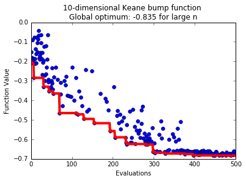

This example considers the Keane bump function which has two
inequality constraints and takes the following form:

.. math::
    f(x_1,\ldots,x_d) = -\left| \frac{\sum_{j=1}^d \cos^4(x_j) - \
    2 \prod_{j=1}^d \cos^2(x_j)}{\sqrt{\sum_{j=1}^d jx_j^2}} \right|

subject to:

.. math::
    0 \leq x_i \leq 5

.. math::
    0.75 - \prod_{j=1}^d x_j < 0

.. math::
    \sum_{j=1}^d x_j - 7.5d < 0

The global optimum approaches -0.835 when d goes to infinity. We will use pySOT
and the penalty method approach to optimize over the Keane bump function and we
will use 4 workers in synchronous parallel. The code that achieves this is

.. code-block:: python

    from pySOT import *
    from poap.controller import Threaded, BasicWorkerThread
    import numpy as np

    maxeval = 500

    data = Keane(dim=10)
    print(data.info)

    controller = ThreadController()

    # Use 4 threads and allow for 4 simultaneous evaluations
    nthreads = 4
    strategy = SyncStrategyPenalty(
            worker_id=0, data=data,
            maxeval=maxeval, nsamples=1,
            exp_design=LatinHypercube(dim=data.dim, npts=2*(data.dim+1)),
            response_surface=RBFInterpolant(kernel=CubicKernel, tail=LinearTail, maxp=maxeval),
            sampling_method=CandidateDYCORS(data=data, numcand=100*data.dim))
    controller.strategy = strategy

    # Launch the threads and give them access to the objective function
    for _ in range(nthreads):
        worker = BasicWorkerThread(controller, data.objfunction)
        controller.launch_worker(worker)

    # Returns f(x) is feasible, infinity otherwise
    def feasible_merit(record):
        return record.value if record.feasible else np.inf

    # Run the optimization strategy and ask the controller for the best FEASIBLE solution
    result = controller.run(merit=feasible_merit)
    best, xbest = result.value, result.params[0]

    # Print the final result
    print('Best value found: {0}'.format(result.value))
    print('Best solution found: {0}'.format(
        np.array_str(result.params[0], max_line_width=np.inf,
                    precision=5, suppress_small=True)))

    # Check constraints
    print('\nConstraint 1: 0.75 - prod(x) = {0}'.format(0.75 - np.prod(xbest)))
    print('Constraint 2: sum(x) - 7.5*dim = {0}'.format(np.sum(xbest) - 7.5*data.dim))

Possible output:

.. code-block:: python

    Best value found: -0.683081148607
    Best solution found: [ 3.11277  3.07498  2.91834  2.96004  2.84659  1.29008  0.17825  0.31923  0.19628  0.24831]

    Constraint 1: 0.75 - prod(x) = -0.0921329885647
    Constraint 2: sum(x) - 7.5*dim = -57.8551318917

A possible progress plot is:

