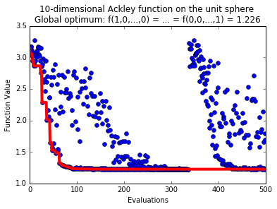

The only way pySOT supports inequality constraints is via a projection method.
That is, the user needs to supply a method that projects any infeasible point
onto the feasible region. This is trivial in some cases such as when we have a
normalization constraint of the form :math:`g(x) = 1 - \|x\| = 0`, in which
case we can just rescale each infeasible point. The purpose of this example
is to show how to use pySOT for such a constraint and we will modify the Ackley
function by adding a constraint that the solution needs to have unit 2-norm.
Our new objective function takes the form

.. code-block:: python

    class AckleyUnit:
        def __init__(self, dim=10):
            self.xlow = -1 * np.ones(dim)
            self.xup = 1 * np.ones(dim)
            self.dim = dim
            self.info = str(dim)+"-dimensional Ackley function on the unit sphere \n" +\
                                 "Global optimum: f(1,0,...,0) = ... = f(0,0,...,1) = " +\
                                 str(np.round(20*(1-np.exp(-0.2/np.sqrt(dim))), 3))
            self.min = 20*(1 - np.exp(-0.2/np.sqrt(dim)))
            self.integer = []
            self.continuous = np.arange(0, dim)
            check_opt_prob(self)

        def objfunction(self, x):
            n = float(len(x))
            return -20.0 * np.exp(-0.2*np.sqrt(np.sum(x**2)/n)) - \
                np.exp(np.sum(np.cos(2.0*np.pi*x))/n) + 20 + np.exp(1)

        def eval_eq_constraints(self, x):
            return np.linalg.norm(x) - 1

We next define a projection method as follows:

.. code-block:: python

    import numpy as np

    def projection(x):
        return x / np.linalg.norm(x)

Optimizing over this function is done via

.. code-block:: python

    from pySOT import *
    from poap.controller import Threaded, BasicWorkerThread
    import numpy as np

    maxeval = 500

    data = AckleyUnit(dim=10)
    print(data.info)

    controller = ThreadController()

    # Use 4 threads and allow for 4 simultaneous evaluations
    nthreads = 4
    strategy = SyncStrategyProjection(
            worker_id=0, data=data,
            maxeval=maxeval, nsamples=1,
            exp_design=LatinHypercube(dim=data.dim, npts=2*(data.dim+1)),
            response_surface=RBFInterpolant(kernel=CubicKernel, tail=LinearTail, maxp=maxeval),
            sampling_method=CandidateDYCORS(data=data, numcand=100*data.dim),
            proj_fun=projection)
    controller.strategy = strategy

    # Launch the threads and give them access to the objective function
    for _ in range(nthreads):
        worker = BasicWorkerThread(controller, data.objfunction)
        controller.launch_worker(worker)

    # Run the optimization strategy and ask the controller for the best FEASIBLE solution
    result = controller.run()

    # Print the final result
    print('Best value found: {0}'.format(result.value))
    print('Best solution found: {0}'.format(
        np.array_str(result.params[0], max_line_width=np.inf,
                    precision=5, suppress_small=True)))

    # Check constraint
    print('\n ||x|| = {0}'.format(np.linalg.norm(result.params[0])))

Possible output:

.. code-block:: python

    Best value found: 1.22580826108
    Best solution found: [-0.00017  0.00106  0.00172 -0.00126  0.0013  -0.00035  0.00133  0.99999 -0.00114  0.00138]
    ||x|| = 1.0

A possible progress plot if the following:

